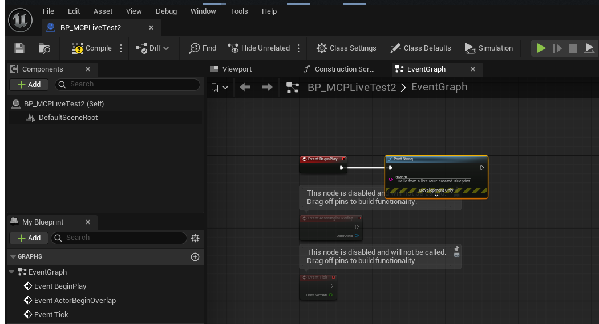

# Live Verification: first real session against a running Editor

Date: 2026-08-08. Target: `A:\UnrealProjects\AntiVirusSquadUE58` (UE 5.8, stock launcher install),
a real ~20-Blueprint game project, not a synthetic test project.

Every milestone up to this point had been build-verified and protocol-verified, but never run
against an actual open Unreal Editor (see the "unverified" sections of `M1_STATUS.md`,
`M2_STATUS.md`, and `M3_STATUS.md`). This session closes that gap.

## What was tested, against real project data

1. **Editor loads the plugin correctly.** Output Log confirmed:
   ```
   LogPluginManager: Mounting Project plugin UnrealMCPBridge
   LogModuleManager: InternalLoadLibrary: 'UnrealMCPBridge' (...UnrealEditor-UnrealMCPBridge.dll)
   LogMCPBridge: UnrealMCPBridge: listening on 127.0.0.1:8765
   ```
2. **Read path (M1), against real data**: `ping`, `get_project_overview`, `list_blueprints`,
   `search_project`, `list_blueprint_graphs`, `find_references`, `read_blueprint_graph_summary`
   all returned correct, sane results against the real project: 19 real Blueprints (e.g.
   `AVS_GameInstance`, `BP_Vacuum`, `WB_MainMenu`), correct parent classes, correct graph/node
   counts (134+ graphs, 1200+ nodes project-wide).
3. **Write path (M2), live**: `create_blueprint` → `add_node` (Event) → `compile_blueprint` →
   `save_blueprint` all succeeded against the real editor, producing a real, saved, compiling
   Blueprint asset (`/Game/_MCPTest/BP_MCPLiveTest2`). Then `add_node` (CallFunction: PrintString)
   → `set_pin_default_value` → `connect_pins` → `compile_blueprint` → `save_blueprint` produced a
   real, working `BeginPlay → Print String` graph. The screenshot below is that exact graph, opened
   in the real Blueprint editor.
4. **Index freshness (M3), live, without restarting the editor**: `get_project_overview`'s
   `blueprintCount` incremented immediately after `create_blueprint`, and `search_project` found
   the new Blueprint by name immediately, confirming the `IAssetRegistry` delegate-driven
   incremental index actually works, not just compiles. This was the single highest-priority
   unverified claim across all three milestones.

## Bug found and fixed during this session

`add_node` with `nodeType: "Event"` created a **duplicate** override-event node instead of
reusing an existing one. This only shows up against a real editor: new Actor-derived Blueprints
come with pre-populated, disconnected stub event nodes (`BeginPlay`, `ActorBeginOverlap`, `Tick`)
that don't exist in a synthetic/mocked graph. The first live `add_node(eventName="ReceiveBeginPlay")`
call created a second `Event BeginPlay` node alongside the existing one instead of recognizing it.

Fixed in `MCPCommandHandler.cpp`'s `HandleAddNode`: before creating a new override-event node, the
graph's existing nodes are checked for a `UK2Node_Event` with a matching `EventReference`. If one
exists, its id is returned with `alreadyExisted: true` instead of creating a duplicate, matching
how the real Blueprint editor behaves when you re-add an event that's already there. Verified fixed
via Live Coding-style rebuild + relaunch + a repeat test showing the node count staying at 3 (not 4)
with `alreadyExisted: true` in the response.

## Screenshot



This is the real Unreal Editor, real Blueprint editor, showing `BP_MCPLiveTest2`'s `EventGraph`
after the tool calls above, not a mockup. The greyed-out `ActorBeginOverlap`/`Tick` nodes are
UE's own default stub events, unconnected and correctly reported as disabled by the engine itself.

## What's still not covered

- Only `create_blueprint`, `add_node` (Event + CallFunction), `set_pin_default_value`,
